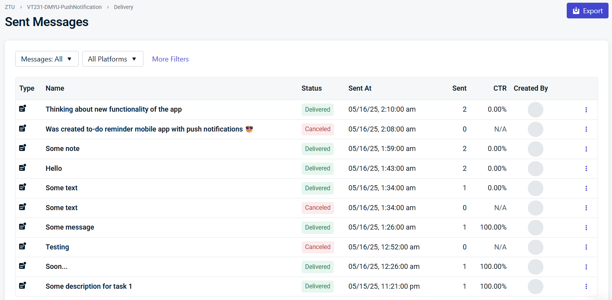
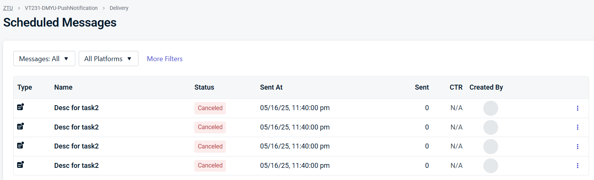

## Setup Instructions
1. Clone the repository
```bash
git clone https://github.com/vt231dmyu/MobileLabsRN2025
cd MobileLabsRN2025
```
2. Create and switch to a local branch `lab-4` based on the remote branch
```bash 
git checkout -b lab-4 origin/lab-4
```
3. Install dependencies
```bash
npm install --legacy-peer-deps
```
4. Start the project
```bash
npx expo run:android
```
5. Access the app (one of the options)
- Use your phone with connected USB.
- Use an Android emulator.
## Result
### To-Do Reminder




