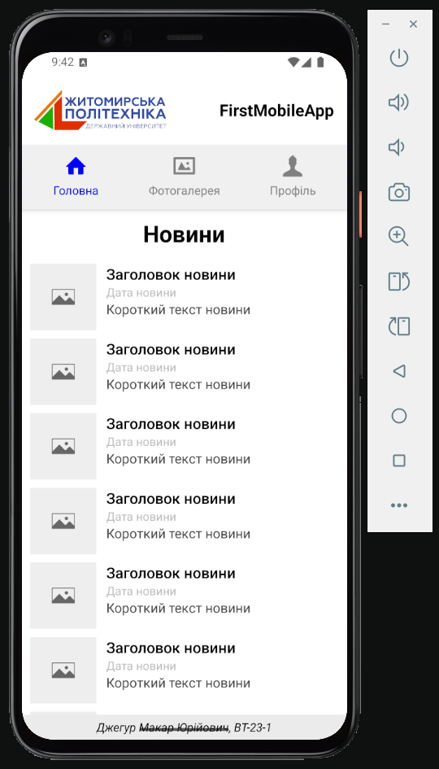
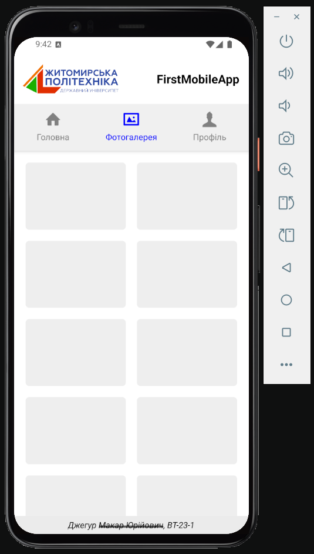
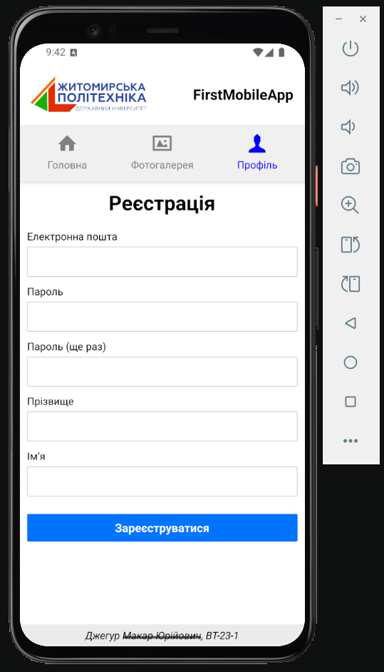

## Setup Instructions
1. Clone the repository
```bash
git clone <repository-url>
cd MobileLabsRN2025
```
2. Install dependencies
```bash
npm install
# or if you're using yarn:
yarn install
```
3. Start the project
```bash
npx expo start
```
4. Access the app (one of the options)
- Scan the QR code with your Expo Go app on your phone.
- Use an Android emulator/iOS simulator.
## Result
### HomeScreen

### GalleryScreen

### ProfileScreen

