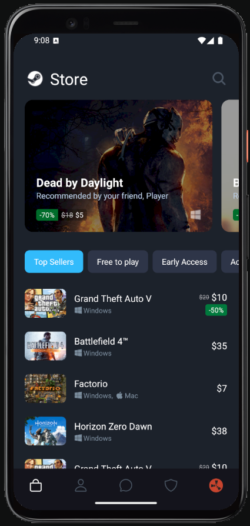
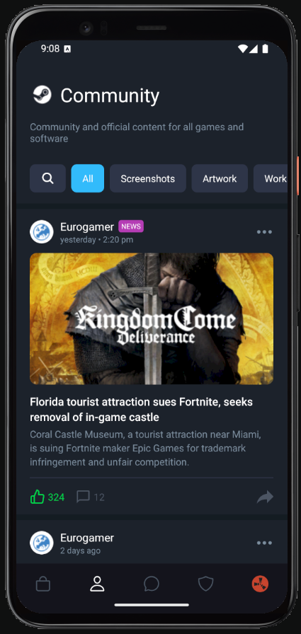
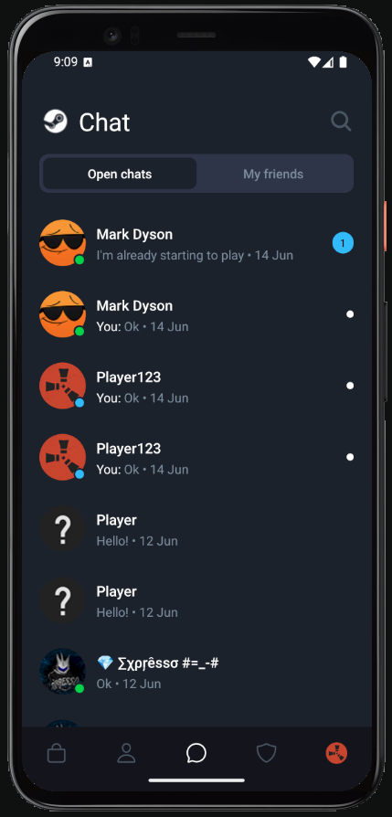
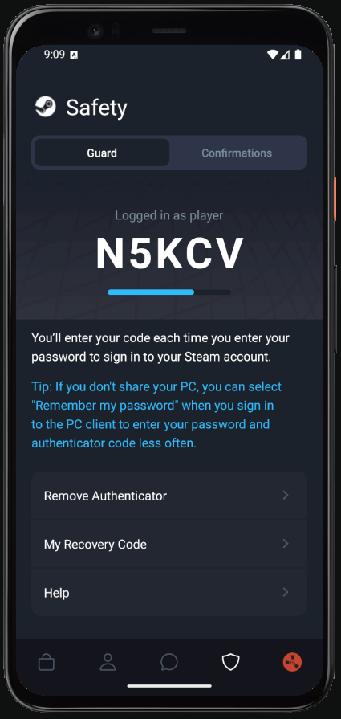
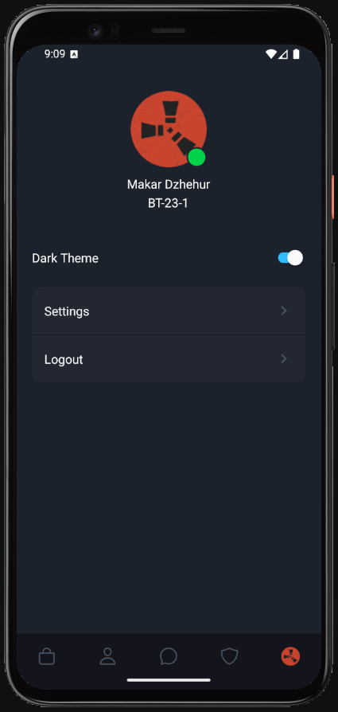
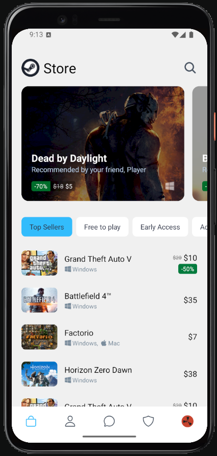
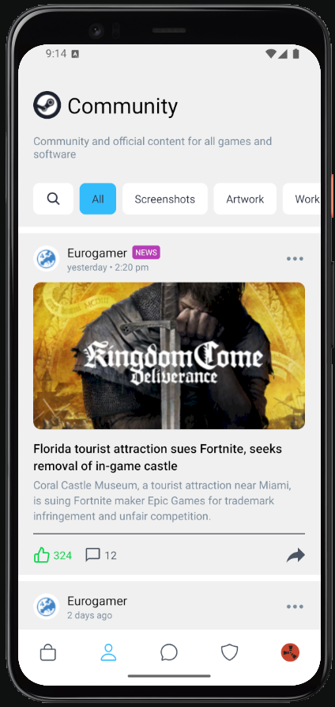
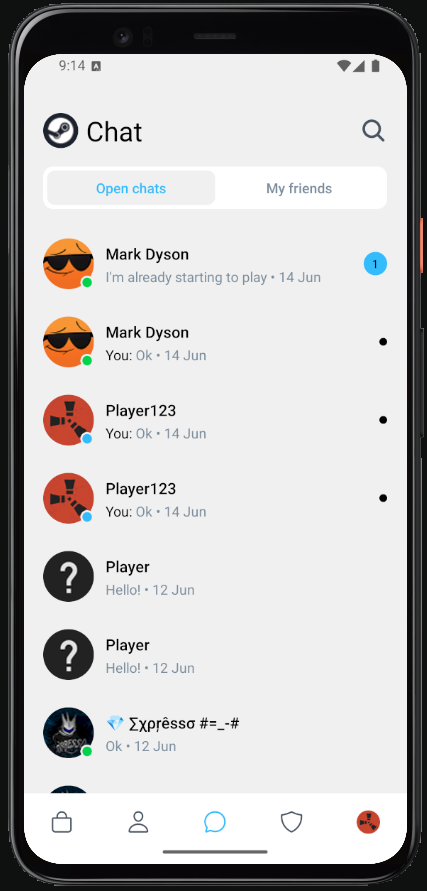
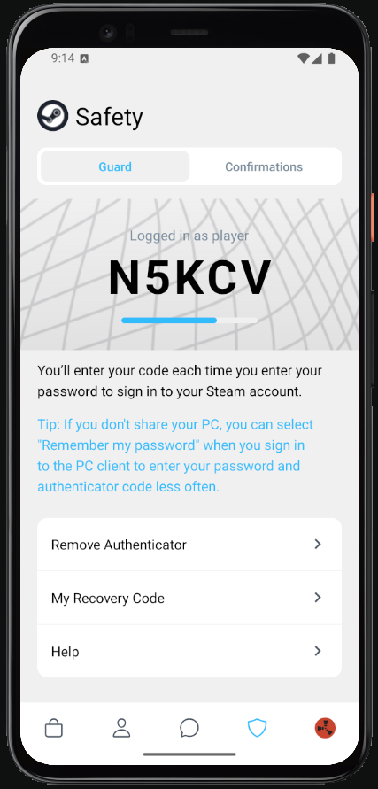
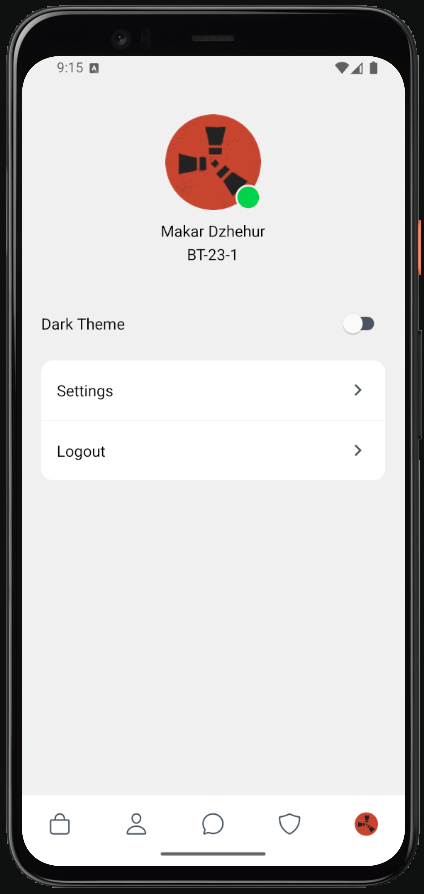

## Setup Instructions
1. Clone the repository
```bash
git clone https://github.com/vt231dmyu/MobileLabsRN2025
cd MobileLabsRN2025
```
2. Install dependencies
```bash
npm install --legacy-peer-deps
```
3. Start the project
```bash
npx expo start
```
4. Access the app (one of the options)
- Scan the QR code with your Expo Go app on your phone.
- Use an Android emulator/iOS simulator.
## Result
### Dark theme
#### StoreScreen

#### CommunityScreen

#### ChatScreen

#### SafetyScreen

#### ProfileScreen

### Light theme
#### StoreScreen

#### CommunityScreen

#### ChatScreen

#### SafetyScreen

#### ProfileScreen

