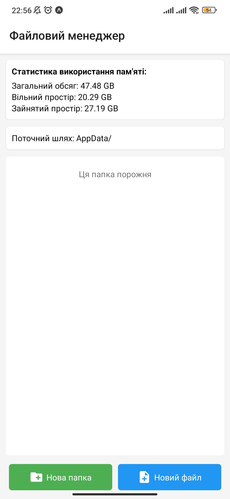

## Setup Instructions
1. Clone the repository
```bash
git clone <repository-url>
cd MobileLabsRN2025
```
2. Create and switch to a local branch `lab-5` based on the remote branch
```bash 
git checkout -b lab-5 origin/lab-5
```
3. Install dependencies
```bash
npm install --legacy-peer-deps
```
4. Start the project
```bash
npx expo start
```
5. Access the app (one of the options)
- Scan the QR code with your Expo Go app on your phone.
- Use an Android emulator/iOS simulator.
## Result
### Create folder

### Create file

### Read file

### Trying update file

### Update file

### File details

### Delete file

### Delete folder

### Empty file manager

