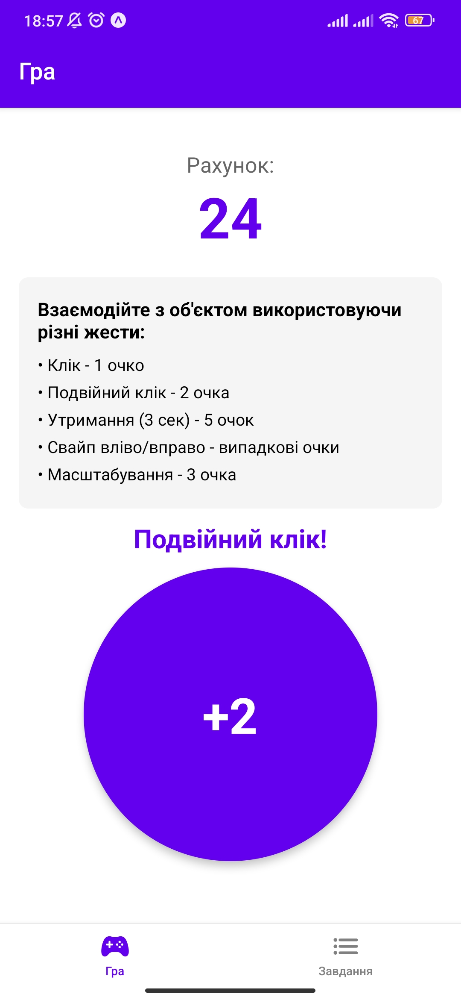
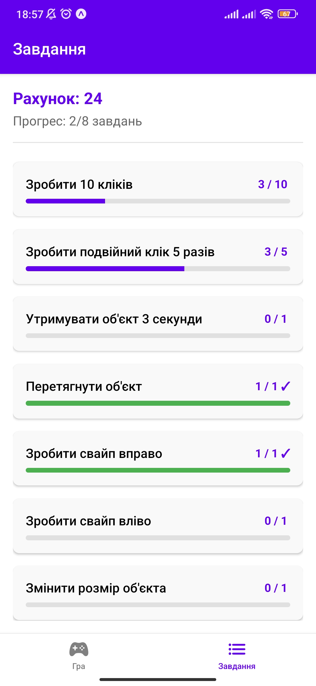
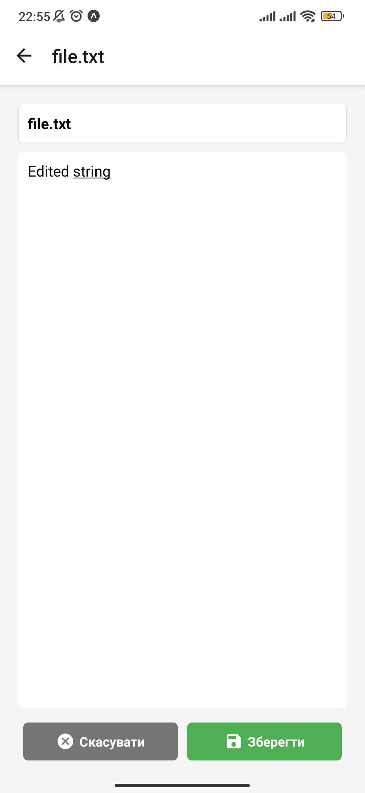
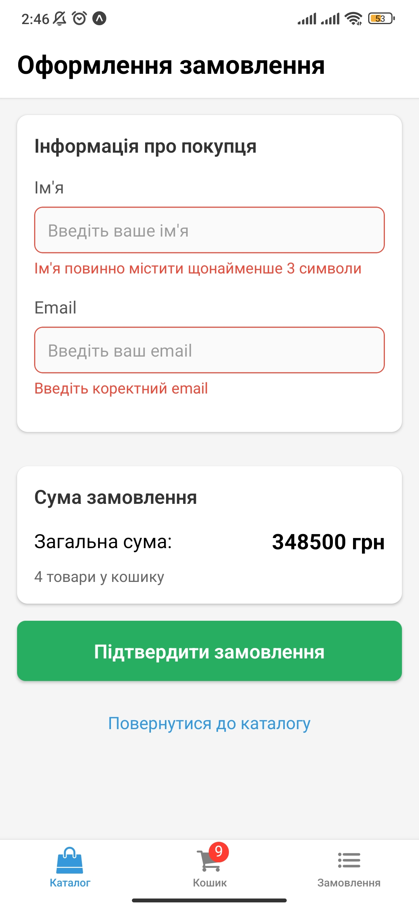
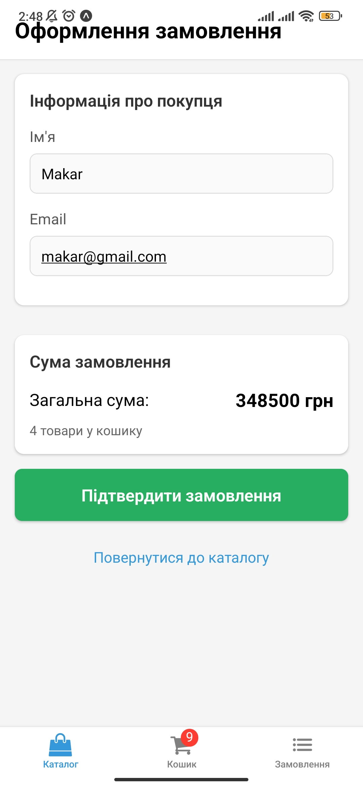
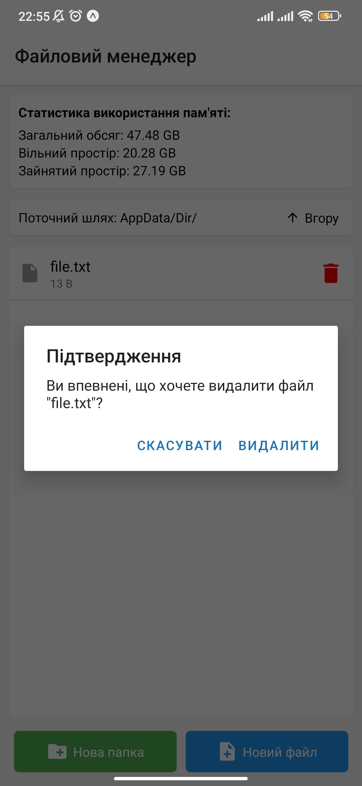
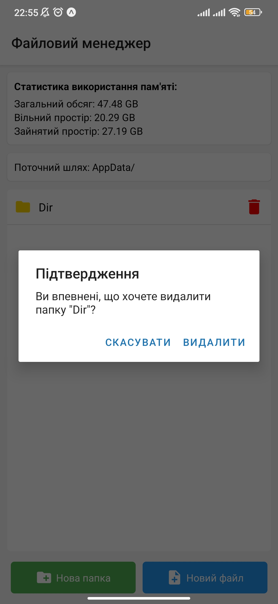

## Setup Instructions
1. Clone the repository
```bash
git clone <repository-url>
cd MobileLabsRN2025
```
2. Create and switch to a local branch `lab-8` based on the remote branch
```bash 
git checkout -b lab-8 origin/lab-8
```
3. Install dependencies
```bash
npm install --legacy-peer-deps
```
4. Start the project
```bash
npx expo start
```
5. Access the app (one of the options)
- Scan the QR code with your Expo Go app on your phone.
- Use an Android emulator/iOS simulator.
## Result
### ProductsScreen

### CartScreen

### OrdersScreen

### CartScreen

### CheckoutScreen

### CheckoutScreen

### CheckoutScreen

### OrdersScreen

